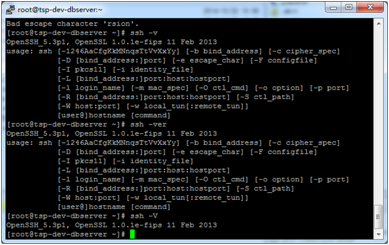
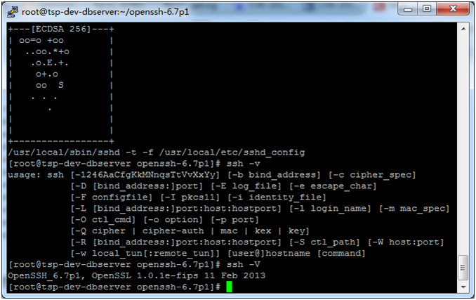

# SSH升级手顺

1． 检查当前版本

```ssh -V ```



2． 将安装包上传到任意目录下

（建议：cd ~）

3． 解压—配置—make—安装
```
tar -zxvf openssh-6.7p1.tar.gz  
cd openssh-6.7p1
./configure 
make
make install  ##需要root权限！！
```
4． 检查当前版本

```ssh -V``` 




5． 重启服务

```service sshd restart   ##重启一下服务```
